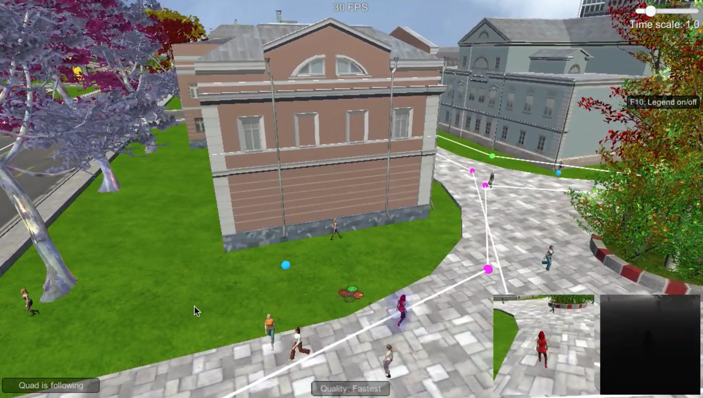

## Udacity Deep Learning Follow me Project ##

In this project, I trained a deep neural network to identify and track a hero target in drone simulation.
In this project I use semantic segmentation technique to categorize each pixels target person, another persons or background.  

[image_0]: ./docs/misc/sim01.png
![Screenshot][image_0]

## Files

`code/model_training.ipyb` Jupyter notebook to train model.
`docs/model_training.html` HTML version of Jupyter Notebooks.
`data/raw_sim_data` Raw simuration data I captured.
`data/train`, `data/validation` train and validation data
`data/weights` trained model weights.
`writeup.md` writeup for follow-me project

##Fully convolutional network(FCN) layers

I used a fully-convolutional network shown below. I used 2 encoder and 2 decoder layers and connected with 1x1 convolutional layer.

[model]: ./docs/misc/model.jpg
![model]

```
 #encoder block
 layer1 = encoder_block(inputs, 64, 2)
 layer2 = encoder_block(layer1, 128, 2)

 #1x1 convolution
 layer3 = conv2d_batchnorm(layer2, 256, kernel_size=1, strides=1)

 #decoder block
 layer4 = decoder_block(layer3, layer1, 128)
 layer5 = decoder_block(layer4, inputs, 64)

 return layers.Conv2D(num_classes, 1, activation='softmax', padding='same')(layer5)
```

Input images are `160 x 160px x 3(RGB)` (resized from 256x256)

[traindata]: ./docs/misc/0_run1cam1_00235.jpeg
![FCN model][traindata]

Create separable convolution layer to improved runtime performance.

Also add batch normalization, during training, it makes network train faster and allows higher learning rates.

I used 1x1 convolutions layer to connect the encoder and decoder layers. With 1x1 convolutional layer it retains spatial information but fully-connected layer loose spatial information.

Bilinear upsampling layers in decoder part.

Bilinear upsampling is a resampling technique that utilizes the weighted average of four nearest known pixels, located diagonally to a given pixel, to estimate a new pixel intensity value.

And concatenate layers to retain details from the previous layers.


##Data collection

I Used `QuadSim_OSX` simulator to collect several data.
`data/raw_sim_data/train/run10` I controlled drone manualy to collect  close and far, different angles Hero's images.
`data/raw_sim_data/train/run20` I collected without Hero but another peoples images with autopilot.
`data/raw_sim_data/train/run30` I collected general images with hero / not hero with autopilot.

pressed image with `code/preprocess_ims.py` and combined given `sample_evaluation_data` data set.

[data-collection]: ./docs/misc/data-collection.png
![data-collection]

#Hyper parameters
I tried several parameters. I got good results from this.
I used AWS's p2.xlarge GPU instance to train model.

Usually learning rate is good to try 0.01 - 0.0001. if I choose  big learning rate, it's first learning but model is not learn well enough, too small learning rate too slow to learn.

epochs need to find good value.


```
learning_rate = 0.005
batch_size = 16
num_epochs = 10
steps_per_epoch = 200
validation_steps = 50
workers = 4
```

I used 1488 images for train, 1184 images for validation.

Fist I tried `batch_size = 64 / epochs = 100`, Looks ok to train but it took 400sec for each epoch even with AWS GPU instance. I could not wait 100 epochs for this may take 10 hours.

[trial01]: ./docs/misc/trial01.png
![trial01]

With community help I choose `batch_size = 16 / epochs = 10` for test. and it worked well. each epoch took around 90 sec and val_loss is better than batch_size = 64, I can run more epochs but 10 epochs already good to go.

[trial02]: ./docs/misc/trial02.png
![trial02]

#Prediction
little less resolution but close hero segmentation working good.

[prediction01]: ./docs/misc/prediction01.png
![prediction01]

far from hero images has more mistakes, I think need to collect more far from hero image to train.

[prediction02]: ./docs/misc/prediction02.png
![prediction02]

I got `0.498` final score from this model.

trained models are located in `data/weights`

#Another object?
It does not work well with another object(dog, cat, car, etc) because  this model is trained only for red color hero person as target. If need to use another objects as a target. need to collect target objects(dog, cat, car, etc) data and train with different segmentation.

#Follow the target
Used trined model tested follow me in the simulation. I uploaded video. Drone follows hero well.

[](https://youtu.be/YBbnGLG6phA)
[video youtube url : https://youtu.be/YBbnGLG6phA](https://youtu.be/YBbnGLG6phA)
